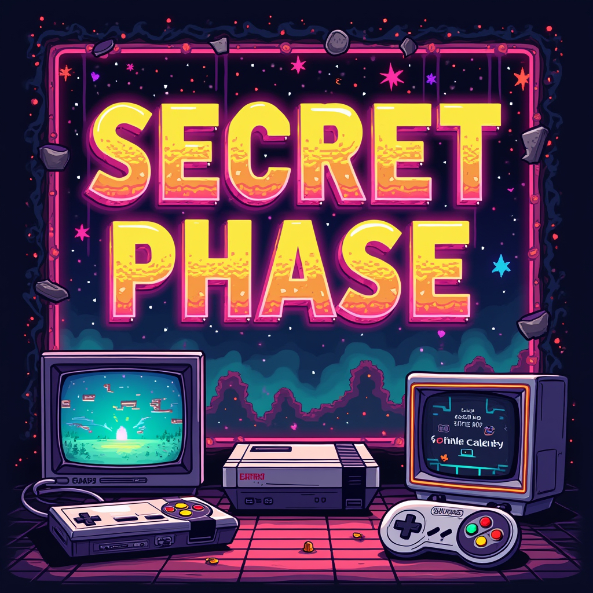

# Capa do Podcast

## Artista

Prompt da imagem criado com: [ChatGPT](https://openai.com/index/chatgpt/)  
Imagem criada com: [OpenArt](https://openart.ai/home)

---

### Você disse:
Poderia me ajudar com um prompt para o OpenArt, para ele criar para mim, uma arte do canal seguindo as ideias de consoles e jogos retrô.

---

### O ChatGPT disse:
Claro! Aqui vai um prompt bem elaborado para você usar no OpenArt e gerar uma arte visual bacana para o seu canal **Fase Secreta**, com a pegada retrô de consoles e jogos:

---

### 🎨 Prompt para OpenArt (com estilo cyberpunk):
> Uma arte colorida e vibrante com estilo retrô-cyberpunk, inspirada em jogos e consoles clássicos dos anos 80 e 90. No centro, o título “Fase Secreta” em letras pixeladas com brilho neon, como em fliperamas antigos, envolto por luzes de néon em tons roxo, azul e rosa. Ao fundo, uma cidade futurista em estilo pixel art, misturada com elementos clássicos de jogos antigos: controles de Super Nintendo e Atari, cartuchos flutuantes, uma TV de tubo exibindo uma tela de "Press Start", fliperamas e símbolos como moedas douradas, corações de vida e fases em 8-bits. Adicione cabos, hologramas, outdoors digitais e um céu noturno com chuva leve, típico do visual cyberpunk. Estilo artístico: pixel art com iluminação neon e estética retro-futurista.

---

### Imagem gerada no OpenArt:

---

### Notas Finais:
- Certifique-se de que o caminho para a imagem está correto. Caso contrário, atualize o caminho ou insira um link direto para a imagem.
- Este arquivo foi criado para documentar o processo de criação da capa do podcast **Fase Secreta**.